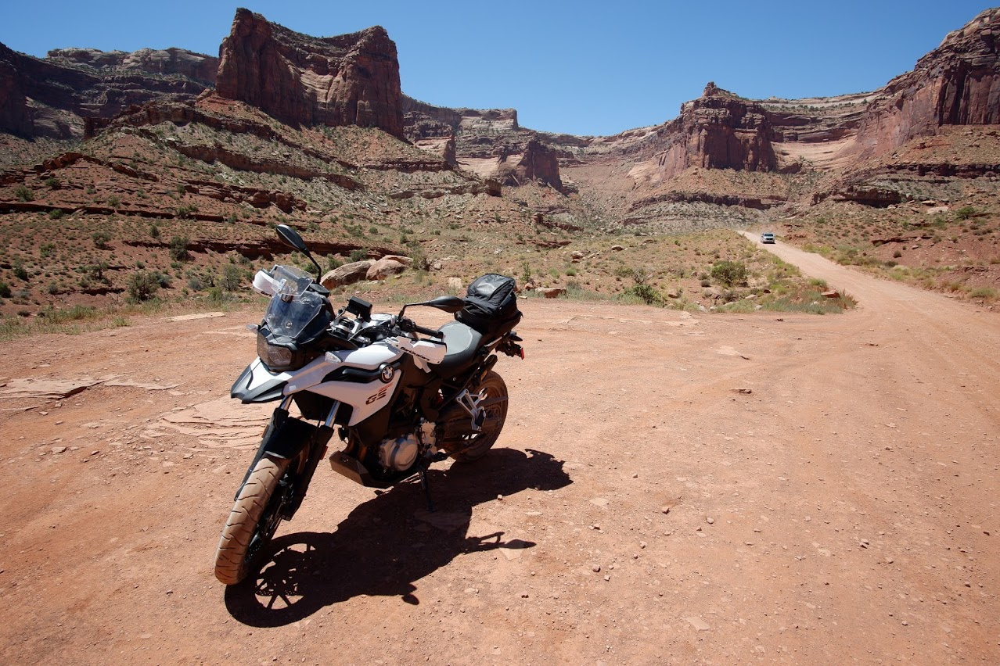

# BMW F750GS/F850GS/F850GSA

This repository contains my notes on the BMW F750GS and F850GS series of
motorcycles.

## Overview

The BMW F750GS/F850GS is a middleweight adventure motorcycle. The bike is a
connsumate all-rounder and is a good choice for commuting in all weather
conditions, riding on twisty roads, touring long distances on the highway and
going on dirt and gravel roads and down many trails.

The bikes are characterized by their 853cc parallel twin engine and their
accessibility to less experienced and shorter riders.

## Table of Contents

- General Information
   - [Models and Packages](models-and-packages.md)
   - [Rider and Service Manuals](manuals.md)
   - [Known Issues](known-issues.md)
- Maintenance
   - [Maintenance Schedule](maintenance-schedule.md)
   - [Engine Oil and Filter Change](engine-oil-and-filter.md)
- Customization
   - [Accessories](accessories.md)
