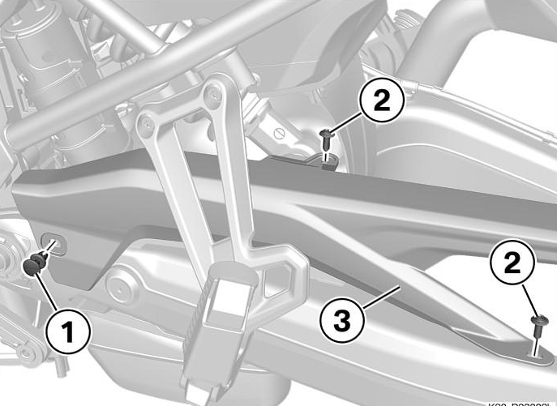
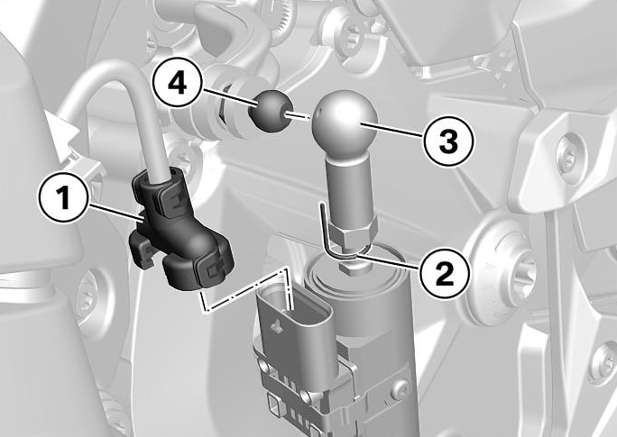
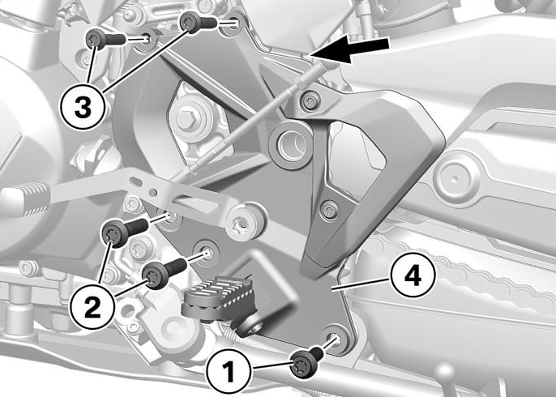
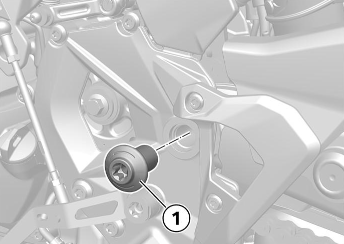
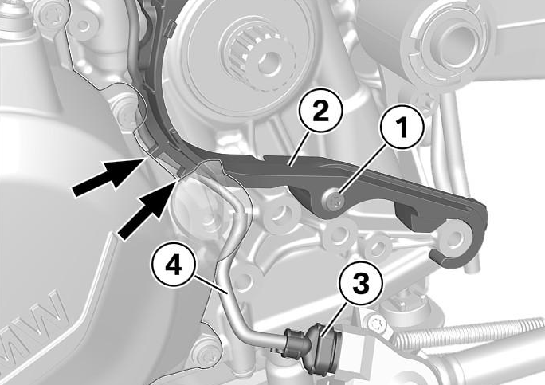
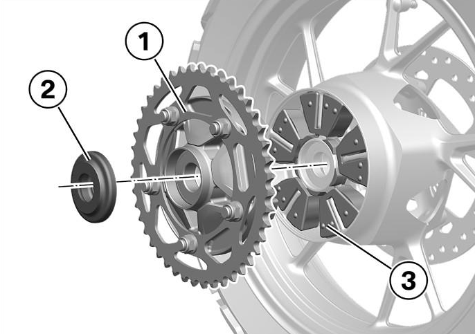
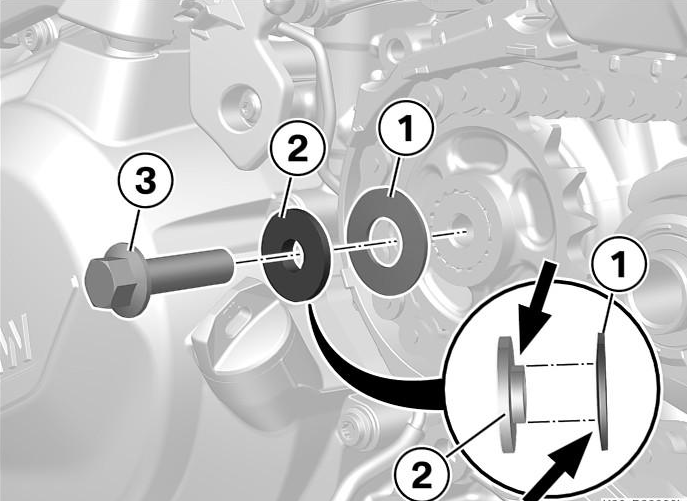

# Chain and Sprocket

## Chain Tension

Place the motorcycle on the side stand with no rider or luggage. Check the
total vertical slop in the chain at a point about 30cm forward from the rear
axle. 

- F750GS: 30-40mm 
- F850GS: 40-50mm

(When correctly set, the top of the chain will hit the swingarm at maximum
deflection.)

If the tension needs to be adjusted, loosen the axle nut with a 36mm wrench,
then adjust the adjusters on both sides of the axle. Tighten the axle nut to
100Nm with thread locker.

# Chain and Sprocket Replacement

The factory sprockets have 17 teeth in the front and 44 in the rear. The
factory chain has 122 links with a pitch of 525.

Note that the bike should be in first gear during the replacement procedure.
The procedure requires disconnecting the shifter linkage, so changing gears
mid-procedure may be difficult.

## Remove Rear Wheel

Support the bike on a stand so that the rear wheel is in the air. It is
recommended to use a scissor stand and rear stand instead of the center stand
to provide additional stability while the wheel is removed.

Decompress the rear brake caliper by pushing it into the brake rotor. 

Remove the rear axle with a 36mm wrench. Loosen the chain adjusters and push
the adjusters fully forward to slacken the chain. Remove the chain from the
rear sprocket and remove the wheel.

## Remove Chain Guard

Remove the rivet and screws securing the chain guard to the swingarm.

## Remove Left Rearset

Disconnect the quickshifter (if installed) and unclip the top end of the
shifter linkage. 

Unbolt and remove the left rearset. This allows access to the
front sprocket.

## Replace Front Sprocket

Remove the front sprocket from the output shaft along with the chain.

Inspect the condition of the guard that protects the engine case in case of a
chain snap. Replace if necessary, taking care that the sidestand killswitch
wire and and breather hoses are correctly routed.

Apply high-temperature anti-seize to the transmission output shaft.

Thread the new chain over the new front sprocket and install the new front
sprocket on the output shaft.

## Replace Rear Sprocket

Remove the rear sprocket carrier assembly and the spacer bushing. 

Use a 19mm socket to remove the nuts securing the sprocket to the carrier.
Install the new sprocket to the carrier, torquing the nuts to 110Nm with thread
locker. 

Remove the dampener element from the rear wheel. Inspect the condition of the
dampener and replace if damaged or deformed. Use silicone spray lubricant when
re-installing the dampener.

Clean the spacer bushing and lubricate it with a high-temperature lithium
grease.

Reinstall the rear sprocket carrier assembly and spacer bushing.

## Reinstallation

Reinstall the chain guard. Use thread locker on the screws.

Lubricate the rear axle with a high-temperature lithium grease. Reinstall the
rear wheel loosely. Push the wheel fully forward and loop the chain over the
sprocket.

Reinstall the bolt for the front sprocket, making care that the washer’s curve
faces outward. Torque to 50 Nm.

Reinstall the left rearset. The central M20 bolt must be replaced with a new
bolt and the new bolt torqued to 200 Nm. Torque the M8 screws to 28 Nm and the
M10 screws to 38Nm.

Reconnect the shifter linkage and quickshifter connector.

Lower the bike onto the ground and adjust the chain tension.
