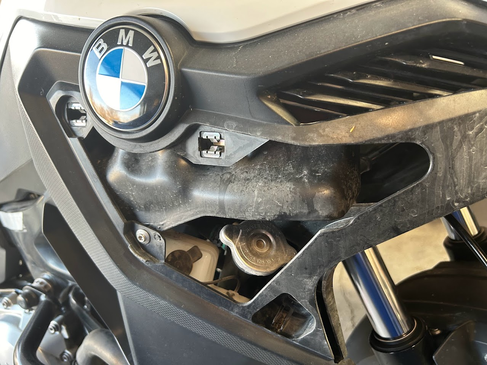
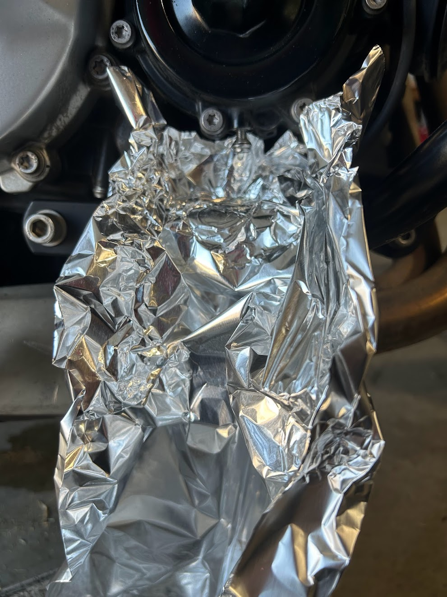
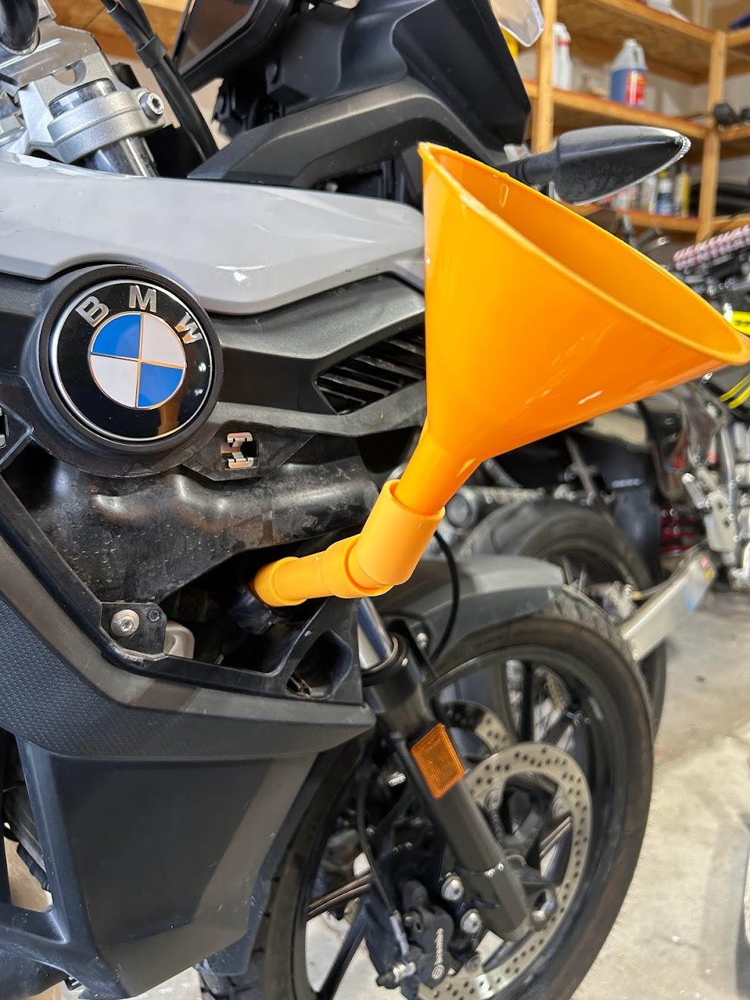

# DIY Coolant Change

_Note: If you live somewhere with a mild climate, you might not ever need to
change your coolant. Talk to your local dealership and see what their local
practice is, and use a coolant tested to check the condition of your coolant._

The official procedure for changing the coolant on the F750GS and F850Gs is quite involved. It includes removing the front fender and the right side fairing to allow clear access to the radiator and coolant resevoir bottle.

That's not what we're gonna do! We're gonna remove the skid plate, two screws, one small panel and the coolant drain plug, and we'll be in like Flynn.

## Coolant

BMW's OEM coolant is a nitrite-free and phosphate-free Hybrid Organic Acid Technology (HOAT) coolant. Zerex G48 is an acceptable substitute.

Using an OAT coolant instead of a HOAT coolant probably isn't a great idea unless it's an emergency. If you do have to use an OAT coolant, flush with distilled water and refill with a HOAT coolant at the next opportunity.

## Tools

You'll need some type of low profile stubby ratchet with a T25 Torx bit to access one of the screws and the coolant drain bolt. Even a standard allen key is a tight fit. I've seen some tools advertised as "Ultra Low Profile Mini Ratchet" with a 1/4 inch drive that should work well.

Most spill-proof coolant funnels won't fit in the radiator's narrow filler neck, so I used a regular funnel and some angled extensions. That did mean I had to do some extra steps to bleed the system.

In addition to your coolant drain pan, I strongly recommend using absorbent mats. It is really easy to make a mess while refilling the system.

## Access

If you have upper engine bars, you'll probably need to remove the right side bar. Sorry.

If you have a skid plate, I recommend removing it so coolant doesn't pool inside it.

Use that stubby ratchet with a T25 Torx bit to remove the two indicated screws holding the coolant access panel to the right side fairing. Then, pull the panel directly away from the bike to pop it out of the clips.

TODO photo of screws here

## Drain

If you have a center stand, stand the bike upright on it. If you don't have a center stand, you'll have to tilt the bike in a later step to get all the coolant out.

**ENSURE THE BIKE IS COMPLETELY COLD. NEVER OPEN THE COOLANT SYSTEM OF A WARM OR HOT ENGINE!!**

Use the stubby ratchet again with a T25 Torx bit to remove the drain bolt. In the photo below, the drain bolt has been partially loosened.

Loosen the fill cap in the access panel to allow air to enter the system and speed up the drainage.

If your bike doesn't have a center stand, you'll need to lean it to the right to get the last of the coolant out.

Replace the drain bolt when done.

## Fill

Open the fill cap, place your funnel and fill the system with coolant.

If you are using a regular funnel instead of a spill proof funnel, squeeze the radiator hoses to dislodge air bubbles, and gently lean the bike side to side to encourage the release of trapped air.

At this point, I replaced the cap, then went on a slow ride around my neighborhood, making sure to lean the bike steeply into both left and right turns. When my engine reached its normal operating temperature, I when parked the bike and waited for it to cool. I then checked the coolant level in the radiator and coolant resevoir and was satisfied the system was at the correct level and free of air pockets. If I had seen a low level or the radiator was not full to the fill neck, I would have added more coolant and repeated this process.

## Reassembly

Reassembly is the opposite of removal. Pop the panel back into the clips and use the stubby ratchet to tighten the two T25 Torx screws. Replace any other removed parts.
