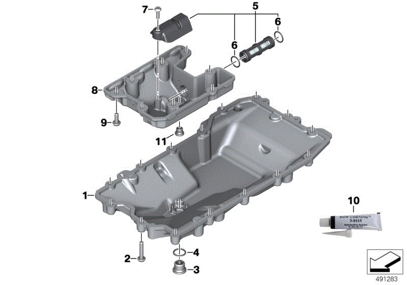

# Engine Oil and Filter change

The 853cc engine has two sumps, a lower sump and an upper sump nestled above
the lower sump. The rider's manual states that an engine oil and filter change
requires 3.0 liters of oil, which corresponds to the capacity of the lower sump.

## Consumables

- SAE 5W-40 API SL/JASO M2 engine oil. OEM is ADVANTEC Ultimate.
    - 3.0 liters for lower sump and filter
    - 3.5-3.75 liters for lower sump, upper sump and filter
- Oil Filter (Part #11427721779)
- Crush washer (Part #07119963252)

[Bob's BMW offers a kit with all required consumables for a lower sump and filter change.](https://www.bobsbmw.com/store/product/10-off-complete-oil-change-kit-for-f750gs-f850gs--adventure)

## Tools

- T-50 Torx socket
- 5mm hex socket or Allen key (Optional, only used for upper sump)
- Oil filter wrench

## Checking Oil Level

1. Bring engine to operating temperature
1. Allow engine to idle until cooling fan starts, then wait 1 minute and turn off engine
1. Raise bike on center stand
1. Wait 1 minute
1. Remove and wipe oil dipstick
1. Insert oil dipstick without screwing it in
1. Check oil level

The difference between the MIN and MAX markings is 0.5 liters.

## Changing Oil and Filter

1. Recommended: Bring engine to operating temperature, then wait for engine to
   partially cool down. This will help the old oil flow out more quickly.
1. Remove skid plate (if installed)
1. Using T-50 socket, remove drain bolt for lower sump (refer to part labeled 3
   in diagram)
1. Remove oil filter
1. Wait for oil to stop draining from lower sump
1. Optional: Use 5mm hex socket or Allen key to remove drain bolt for upper
   sump (refer to part labeled 11 in diagram)
1. Wait for oil to drain
1. Replace 5mm drain bolt and T-50 drain bolt, using new crush washes
1. Install new filter _carefully_. The location of the filter will require
   installation using an oil filter wrench. However, care must be taken not to
over-tighten the filter, or the seal will be damaged and cause an oil leak. The
ADVRider forums report this mistake being made by professional BMW techs at BMW
dealerships! Tighten the filter no tighter than you would tighten by hand.

Bring the engine to operating temperature and check the oil level. Add or
remove oil as needed to bring oil level within spec.
