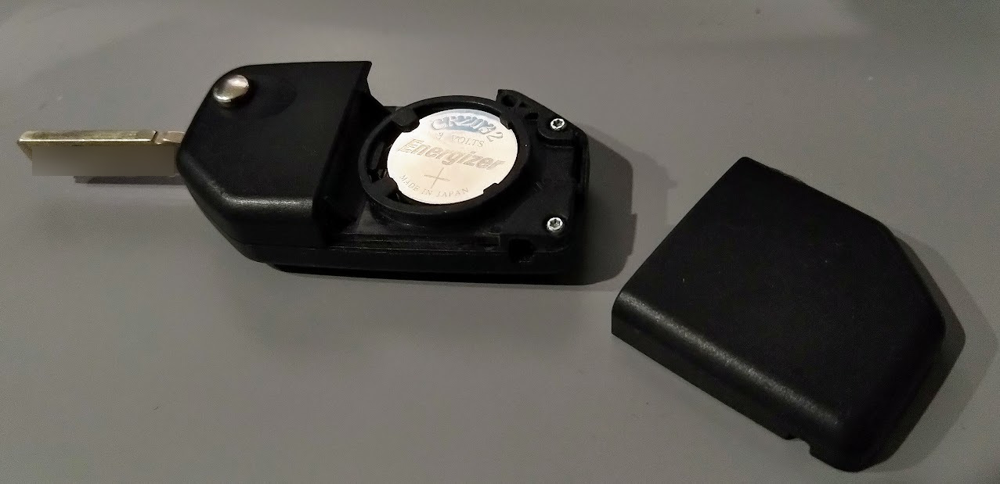
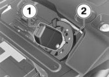

# Keyless Ignition Fob 

## Battery Replacement

The key fob for the keyless ignition uses a CR2032 lithium button cell battery.
The motorcycle will display a message when this battery needs to be replaced.
In my experience, the factory battery needed replacement after 1 year.

To replace the battery, flip the physical key open and then place your finger
in the void left by the key. Pry up on the battery cover until it pops open.
The battery cover requires a great deal of force to open! Slide the battery out
of the clip and slide a new battery in. Test the keyless ignition and then
replace the battery cover.

## Emergency Start

The motorcycle can be started even if the keyless ignition fob battery is fully
drained. Use the physical key to remove the motorcycle seat, insert the key fob
into the round antenna and start the bike. Remove the key, replace the seat and
ride the bike (hopefully to a store that sells CR2032 batteries.)

