# Valve Clearance Adjustment

This guide assumes the reader is familiar with valve adjustment on a motorcycle.
If you haven't done a valve adjustment before, go practice on a dirt bike!

## Access

Remove the front fender by removing the two screws and unclipping the spray guard and fender.

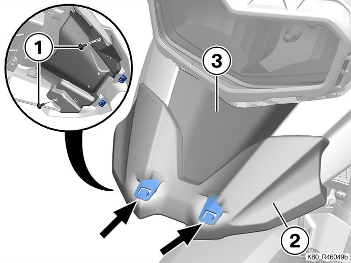

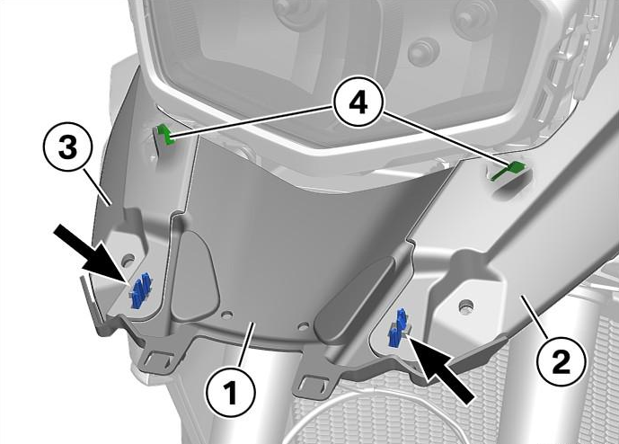

Remove the fuel tank panel by removing the four screws and unclipping the panel.

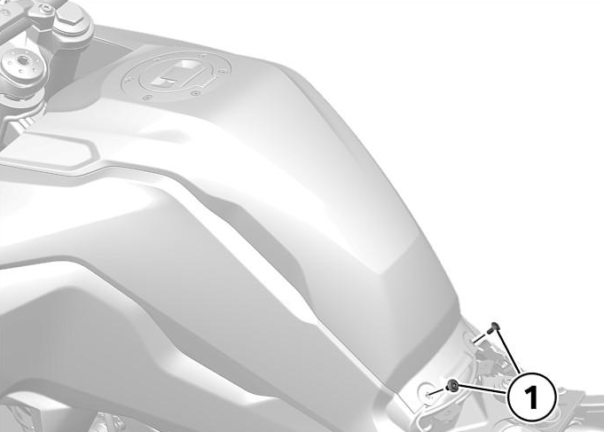

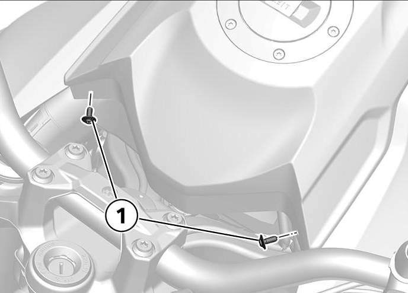

Unclip the radiator cowls on both sides.
Remove the side fairings by removing the six screws and bolts on each side and uncliping the retaining tab on each side.

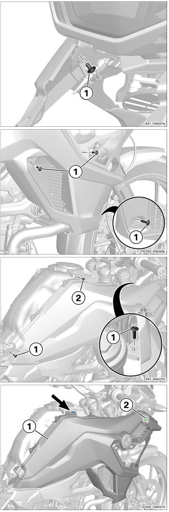

Disconnect the 2 hoses from the fuel filler cap.
Remove the 2 screws and raise the fuel tank on a woodblock. 
Disconnect the fuel pump. 
Disconnect the fuel lines and remove the zip tie. 
If the bike has a keyless ride system, unplug the keyless ride connector and release the cable from its routing.

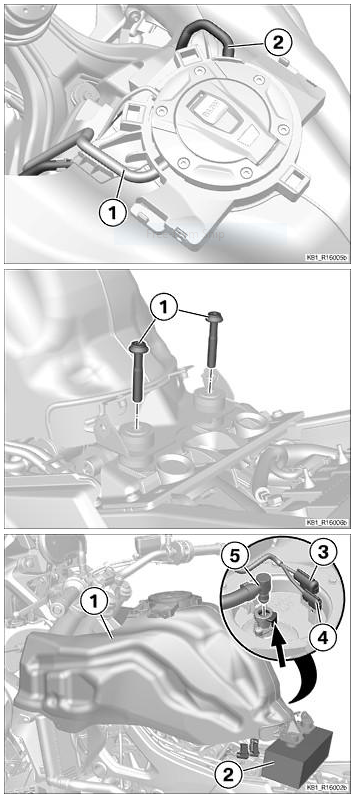

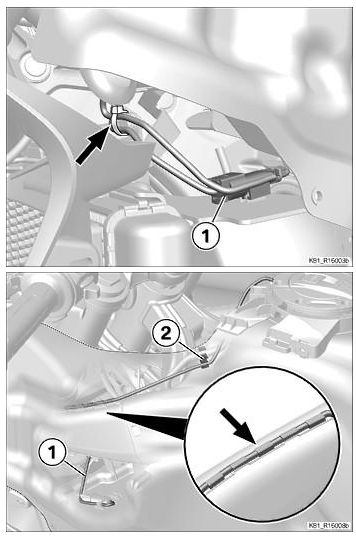

Pull the fuel tank off the bike.

Unclip the intake snorkels on each side of the airbox.

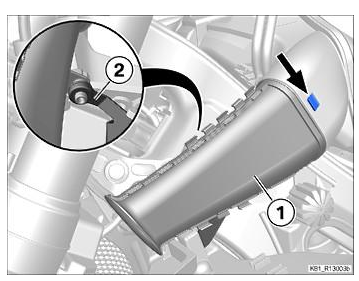

Remove the ventilation hoses from the airbox.
Remove the bolt securing the front of the airbox.

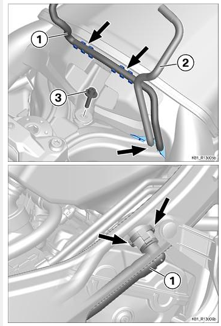

Using the appropriate pliers, remove the [Oetiker](https://www.oetiker.com/) low profile clamp rings securing the airbox to the instake.

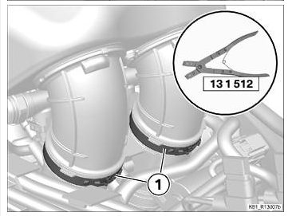

Disconnect the air temperature sensor.

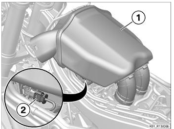

Remove the airbox.

Disconnect the igniton coils.
Remove the ignition coils from the cylinder head.

Remove the indicated bolts and rivets to loosen the air ducts and radiator.

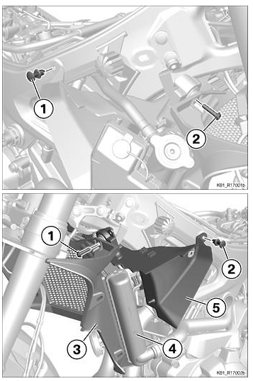

Remove the crankshaft access cover.

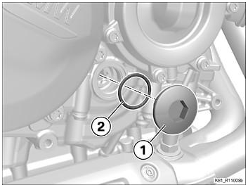

Disconnect the fuel injectors.

Remove the four valve cover screws.
Remove the valve cover and the gaskets.

## Clearance Check

Measure the valve clearances as you normally would for an overhead valve engine. 
Clearances for intake and exhaust are identical for the F750GS and F850GS:

|intake|exhaust
-|-
0.11-0.20mm|0.30-0.35mm|

## Clearance Adjustment

Set the engine to the top dead center (TDC) position as indicated by the camshaft alignment marks.
The camshaft lobes should match the picture.
A pin can be placed in the shown location to hold the engine at TDC.

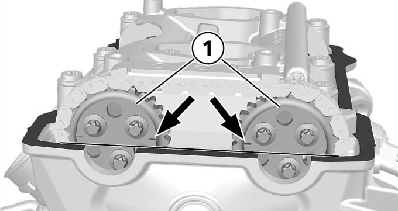
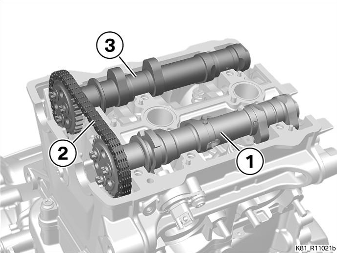
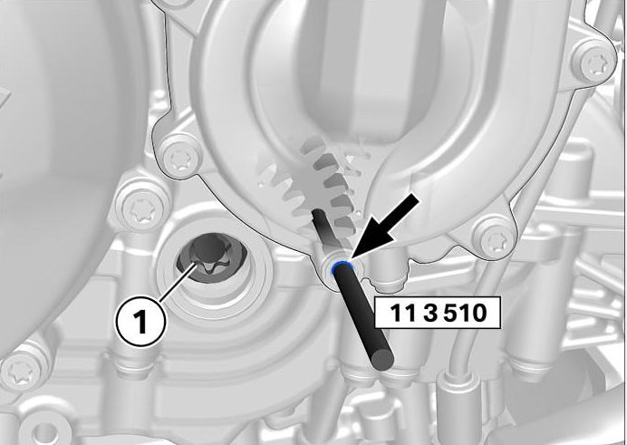

Remove the timing chain tensioner.

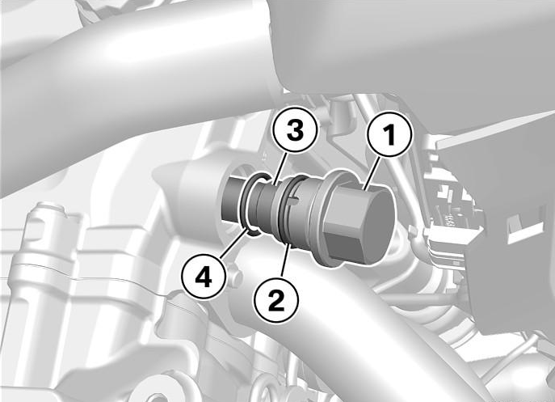

Remove the screws securing the slide rail and camshaft brackets, taking care to gradually loosen the screws uniformly in a crosswise order.
Remove the two sealing rings from the spark plug holes. 
Take note of and keep track of the positioning dowels.

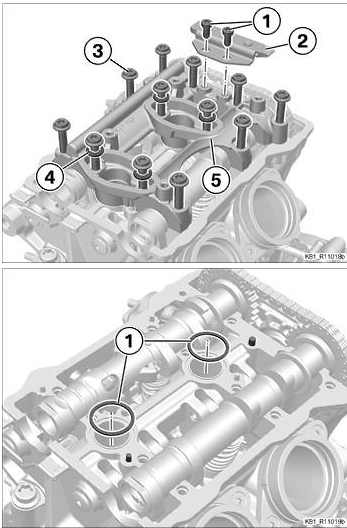

Swing the rocker arms up to access the valve shims. 
Measure and replace the shims as necessary.

Swing the rocker arms back down.

Lubricate the camshaft seat with engine oil or assembly lube.

Reinstall the intake cam and exhaust cam and triple-check the alignment and position are correct.

Lubricate and install the two sealing rings. (Use new rings if the old ones are damaged.)

Replace any positioning dowels as necessary.

Lubricate, align and reinstall the camshaft bracket.

Reinstall the bracket screws using new o-rings. Tighten in two stages first to 5Nm and then to 15Nm in the indicated order.

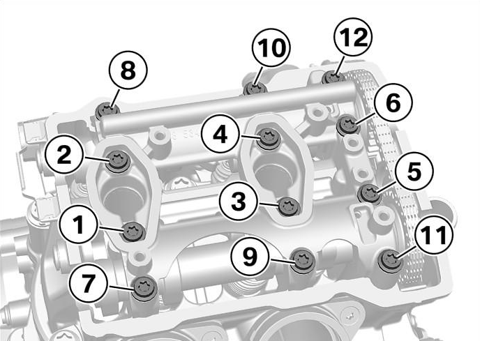

Reinstall the slide rail. Tighten the bolts to 10Nm.

Reinstall the timing chain tensioner. Tighten to 15Nm.

Check the timing, then remove the TDC alignment pin, crank the engine over and check the timing again.

Check the valve clearances again.

## Reassembly

Reinstall the seals, using Drei Bond 1209 or another appropriate seal in the indicated areas.

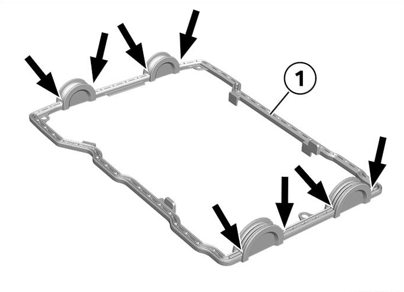

Reassemble the bike, using the following torque values:

- Valve cover screws: 10Nm
- Crankshaft cover: 10Nm
- Radiator and air duct brackets: 8Nm
- Airbox: 8Nm
- Fuel tank bolts (long shouldered bolts): 19Nm
- Bolts for plastics/fairings: No torque specified, snug it up

Note that when reconnecting the fuel line you should hold the latch open while inserting the quick connect and then close it when the connector is in position. Otherwise, the latch can damage the o-ring and cause a fuel leak.

