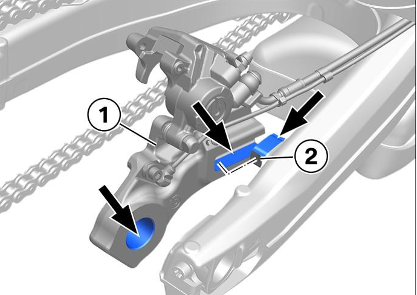

## Front Wheel

### Removal

Loosen the four Torx bolts that clamp the front axle.

emove the internal hex screw from the left side of the front axle. You may need to hold the opposite end of the axle in place.

Raise the front wheel in the air.

Pull the axle free from the right side of the bike using the appropriate hex driver.

Remove the wheel.

Remove the spacer from the left side of the wheel.

### Installation

Clean the spacer and lubricate it with a high-temperature lithium grease. Install the spacer.

Install the wheel into the forks and insert the axle. Install the left side axle screw and tighten to 50 Nm.

Gradually tighten the right side clamp bolts to 19 Nm in a series of three passes. Gradually tighten the left side clamp bolts to 19 Nm in a series of three passes.

## Rear Wheel

### Removal

Decompress the rear brake caliper by pushing it into the brake rotor. 

Loosen the rear axle nut with a 36mm wrench. Raise the rear wheel in the air.

Remove the rear axle nut and washer.

Loosen the chain adjusters and push the adjusters fully forward to slacken the chain. Remove the chain from the rear sprocket.

Remove the axle.

Remove the wheel and hang the brake caliper aside. Remove the spacer bushings from both sides of the wheel. 

Remove the rear sprocket carrier.

Inspect the dampening element in the wheel for damage or deformation. Replace if necessary.

### Installation

Clean the rear brake caliper's guide surfaces and lubricate them with anti-seize. Position the rear brake caliper into the guide.

If the dampening element was removed, lubricate with sillicone spray and reinstall.

Clean the spacers and rear sprocket carrier seals. Lubricate them with a high temperature lithium grease.

Install the bushings and rear sprocket carrier on the wheel.

Clean the axle and lubricate it with a high-temperature lithium grease.

Install the rear wheel into the swingarm and rear brake caliper. Take care not to damage the wheel speed sensor or sensor ring. Insert the rear axle and loosely reinstall the nut and washer.

Push the wheel fully forward and loop the chain over the sprocket.

[Adjust the chain tension and torque the axle nut to spec.](chain-and-sprocket.md#chain-tension)